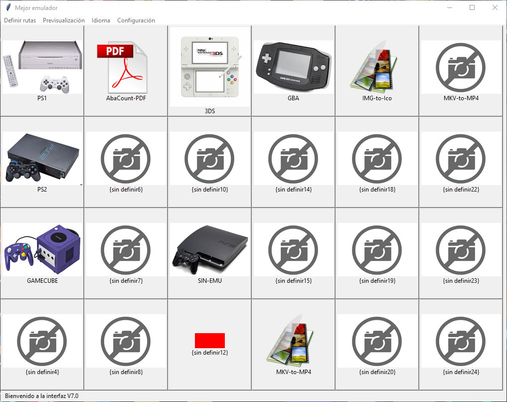

# Gestor de aplicaciones para windows (acceso rápido)

El proyecto contempla una interface totalmente personalizable, se trata de una grilla, donde puedes definir accesos rápidos a las aplicaciones que desees y tengas en tu pc.

En el ejemplo, se utiliza la grilla para acceder abrir los programas con 1 click.

El usuario puede definir:

-La ruta de acceso donde se encuentra su archivo exe o programa de preferencia

-La imagen de previsualización que acompaña a cada acceso

-El nombre que acompaña a cada acceso

-Seleccionar el idioma de preferencia 
	Español
	Inglés
	Otros

# NOTA: Se deja un vídeo de demostración donde se establece un ejecutable, una imagen de previsualizacion, el nombre y se hace el cambio de idioma.
